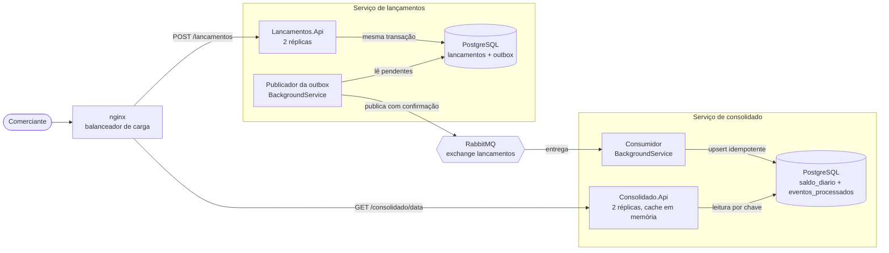

# Fluxo de Caixa

Solução para um comerciante controlar o fluxo de caixa diário. Ela registra lançamentos de débito e crédito e informa o saldo consolidado de cada dia.

São dois serviços independentes, cada um com seu próprio banco. Eles conversam apenas por eventos assíncronos no RabbitMQ. Não existe chamada HTTP entre eles.

- **Lancamentos.Api** registra e lista os lançamentos.
- **Consolidado.Api** mantém o saldo de cada dia já calculado e responde a consulta do saldo.

Stack: .NET 10, ASP.NET Core Minimal APIs, PostgreSQL com EF Core, RabbitMQ (RabbitMQ.Client, sem frameworks de mensageria), xUnit com Testcontainers, k6 e docker compose.

## Sumário

- [Arquitetura](#arquitetura)
- [Invariante central](#invariante-central)
- [Como rodar](#como-rodar)
- [Exemplos de chamadas](#exemplos-de-chamadas)
- [Como rodar os testes](#como-rodar-os-testes)
- [Requisitos não funcionais e como são comprovados](#requisitos-não-funcionais-e-como-são-comprovados)
- [Estrutura do repositório](#estrutura-do-repositório)
- [Premissas e simplificações](#premissas-e-simplificações)
- [Evolução futura](#evolução-futura)
- [Documentação detalhada](#documentação-detalhada)

## Arquitetura



O fluxo de um lançamento:

1. O cliente faz `POST /lancamentos` na Lancamentos.Api.
2. A API grava o lançamento e o evento `LancamentoRegistrado` na tabela `outbox`, na mesma transação, e responde `201`.
3. O publicador da outbox, que roda dentro da Lancamentos.Api, lê os eventos pendentes a cada 500 ms e os publica no RabbitMQ. Cada evento só é marcado como publicado depois da confirmação do broker.
4. O consumidor, que roda dentro da Consolidado.Api, recebe o evento e atualiza a tabela `saldo_diario` de forma idempotente. Só depois do commit ele confirma a mensagem.
5. A Consolidado.Api responde o saldo de um dia lendo essa tabela por chave, com cache em memória de 5 s.

Cada API roda com 2 réplicas atrás de um nginx, que distribui a carga. Só uma réplica publica a outbox por vez, e as réplicas do consolidado consomem a mesma fila em paralelo ([ADR 0008](docs/adr/0008-escalabilidade-horizontal.md)).

Os diagramas de contexto, de containers e de sequência estão em [docs/arquitetura.md](docs/arquitetura.md). A arquitetura alvo na Azure está em [docs/arquitetura-azure.md](docs/arquitetura-azure.md).

## Invariante central

> **Um lançamento só é confirmado ao cliente quando ele e o seu evento estão persistidos na mesma transação. A partir daí a entrega é garantida (at-least-once) e o processamento é idempotente.**

Na prática isso significa:

- **Gravação atômica.** O lançamento e o evento entram no mesmo `SaveChanges`, que o EF Core executa numa única transação. Ou os dois existem, ou nenhum existe ([LancamentosEndpoints.cs](src/Lancamentos.Api/Endpoints/LancamentosEndpoints.cs)).
- **Entrega garantida.** O evento fica na outbox até o RabbitMQ confirmar que guardou a mensagem. A mensagem é persistente e é publicada com `mandatory`. Se o broker estiver fora, ou se não houver fila para receber a mensagem, o evento continua pendente e é publicado no próximo ciclo ([OutboxPublisher.cs](src/Lancamentos.Api/Messaging/OutboxPublisher.cs)).
- **Processamento idempotente.** O consumidor grava o Id do evento em `eventos_processados` na mesma transação que soma o valor ao saldo. Um evento entregue duas vezes é somado uma vez só ([AtualizadorDeSaldo.cs](src/Consolidado.Api/Data/AtualizadorDeSaldo.cs)).

Por consequência, o consolidado é **eventualmente consistente**. Em operação normal, o saldo reflete um lançamento em poucos segundos. Com alguma parte fora do ar, ele converge assim que tudo volta.

## Como rodar

Pré-requisito: Docker com Docker Compose.

```bash
docker compose up -d --build
```

Esse comando sobe os dois bancos, o RabbitMQ, 2 réplicas de cada API e o nginx na frente delas. Na primeira vez o build das imagens leva alguns minutos.

| Serviço | Endereço |
|---|---|
| Lancamentos.Api (via nginx) | http://localhost:5001 |
| Consolidado.Api (via nginx) | http://localhost:5002 |
| Painel do RabbitMQ | http://localhost:15672 (usuário `fluxo`, senha `local-dev`) |
| PostgreSQL de lançamentos | localhost:15432 |
| PostgreSQL do consolidado | localhost:15433 |

As APIs exigem o header `X-Api-Key`. Localmente a chave é `local-dev-key`.

Toda resposta traz o header `X-Upstream-Addr`, que mostra qual réplica atendeu. Para mudar o número de réplicas:

```bash
docker compose up -d --scale lancamentos-api=3 --scale consolidado-api=3
```

As senhas e a API Key têm valores padrão `local-dev` só para os containers descartáveis desta máquina. Para trocar, copie `.env.example` para `.env` e altere os valores. Nenhum segredo real fica no repositório. Em produção esses valores viriam de um cofre como o Azure Key Vault.

Para parar e apagar os dados:

```bash
docker compose down -v
```

### Rodando as APIs fora do Docker

Para depurar, suba só a infraestrutura com Docker e rode as APIs com o .NET 10 SDK. O ambiente `Development` já aponta para as portas dos bancos e do RabbitMQ. Nesse modo não há nginx: cada API atende direto nas portas 5001 e 5002.

```bash
docker compose up -d postgres-lancamentos postgres-consolidado rabbitmq
```

```bash
dotnet run --project src/Lancamentos.Api
```

```bash
dotnet run --project src/Consolidado.Api
```

## Exemplos de chamadas

Registrar um crédito. O header `Idempotency-Key` é opcional. Se a mesma chave for enviada de novo, a API devolve o lançamento original sem duplicar.

```bash
curl -i -X POST http://localhost:5001/lancamentos \
  -H "X-Api-Key: local-dev-key" \
  -H "Content-Type: application/json" \
  -H "Idempotency-Key: venda-0001" \
  -d '{"data":"2026-10-05","tipo":"Credito","valor":250.00,"descricao":"Venda balcao"}'
```

Resposta `201 Created`. Repetir a mesma chamada retorna `200 OK` com o mesmo lançamento.

```json
{"id":"01a10e47-1818-7c0c-92b2-78ba6e66ff44","data":"2026-10-05","tipo":"Credito","valor":250.00,"descricao":"Venda balcao","criadoEm":"2026-10-05T22:55:02.68104+00:00"}
```

Registrar um débito:

```bash
curl -X POST http://localhost:5001/lancamentos \
  -H "X-Api-Key: local-dev-key" \
  -H "Content-Type: application/json" \
  -d '{"data":"2026-10-05","tipo":"Debito","valor":80.10,"descricao":"Fornecedor"}'
```

Listar os lançamentos de um dia:

```bash
curl -H "X-Api-Key: local-dev-key" "http://localhost:5001/lancamentos?data=2026-10-05"
```

Consultar o saldo consolidado de um dia:

```bash
curl -i -H "X-Api-Key: local-dev-key" http://localhost:5002/consolidado/2026-10-05
```

```json
{"data":"2026-10-05","totalCreditos":250.00,"totalDebitos":80.10,"saldo":169.90}
```

Se o banco do consolidado estiver fora, a resposta é o último valor conhecido, com os headers `X-Stale-Data: true` e `Age` (os segundos desde a última leitura no banco). Se o dia nunca foi lido antes, a resposta é `503` com `Retry-After`.

Um lançamento inválido devolve `400` com os erros por campo:

```bash
curl -X POST http://localhost:5001/lancamentos \
  -H "X-Api-Key: local-dev-key" \
  -H "Content-Type: application/json" \
  -d '{"data":"2026-10-05","tipo":"Pix","valor":0,"descricao":""}'
```

```json
{"title":"One or more validation errors occurred.","status":400,"errors":{"tipo":["Tipo deve ser 'Credito' ou 'Debito'."],"valor":["Valor deve ser maior que zero."],"descricao":["Descrição é obrigatória."]}}
```

Health check de cada serviço, sem API Key. Cada um verifica apenas o próprio banco.

```bash
curl http://localhost:5001/health
```

```bash
curl http://localhost:5002/health
```

> No Git Bash do Windows, evite acentos dentro do `-d` do curl. O terminal não envia o texto em UTF-8 e a API responde `400` por JSON inválido. A API aceita acentos normalmente, como mostram os testes de integração.

## Como rodar os testes

### Unitários e de integração

Pré-requisitos: .NET 10 SDK e Docker rodando. Os testes de integração usam Testcontainers para subir PostgreSQL e RabbitMQ reais.

```bash
dotnet test --solution FluxoCaixa.slnx
```

São 59 testes, executados em cerca de 40 segundos:

- **Unitários:** validações da entidade `Lancamento` e cálculo do saldo em `SaldoDiario`.
- **Integração da Lancamentos.Api:** o POST grava o lançamento e a outbox juntos, a `Idempotency-Key` não duplica (inclusive com 10 requisições simultâneas), a API aceita lançamentos com o RabbitMQ fora, a publicação é ordenada, persistente e confirmada, duas réplicas publicando ao mesmo tempo não duplicam eventos, além de API Key e health check.
- **Integração da Consolidado.Api:** o consumidor soma corretamente, ignora evento duplicado, não perde atualizações concorrentes, manda mensagem inválida para a DLQ, limita as reentregas antes da DLQ, usa cache e responde o último valor conhecido com o banco fora.

### Carga com k6

Com a solução no ar (`docker compose up -d --build`):

```bash
bash scripts/carga.sh
```

O k6 roda em um container, dentro da rede do compose. São 5 minutos a 50 req/s no `GET /consolidado`, seguidos de 2 minutos a 150 req/s. Durante o pico, 10 POSTs por segundo chegam à Lancamentos.Api. O resultado é salvo em [docs/carga/resultado-k6.md](docs/carga/resultado-k6.md).

### Capacidade

Com a solução no ar, mede até onde o consolidado aguenta com 1 e com 2 réplicas. A taxa sobe em degraus de 30 s, de 1.000 a 10.000 req/s:

```bash
bash scripts/capacidade.sh 1
```

```bash
bash scripts/capacidade.sh 2
```

Os resultados ficam em [docs/carga](docs/carga).

### Caos

```bash
bash scripts/caos.sh
```

O script sobe tudo e envia lançamentos sem parar. Enquanto isso ele para uma réplica da Lancamentos.Api e sobe de novo, depois mata a Consolidado.Api e o RabbitMQ. Em seguida confirma que nenhum POST falhou, sobe tudo de novo e verifica que o saldo convergiu para o valor exato. O último resultado está em [docs/caos/resultado-caos.md](docs/caos/resultado-caos.md).

### Integração contínua

O workflow [ci.yml](.github/workflows/ci.yml) roda build e testes a cada push. Depois roda o teste de caos e uma versão curta do teste de carga, com os mesmos thresholds.

## Requisitos não funcionais e como são comprovados

| Requisito | Decisão | Teste que comprova |
|---|---|---|
| O serviço de lançamentos não fica indisponível se o consolidado cair | Dois serviços com bancos separados ([ADR 0001](docs/adr/0001-dois-servicos.md)). Comunicação apenas assíncrona ([ADR 0002](docs/adr/0002-comunicacao-assincrona.md)). A Lancamentos.Api depende só do próprio banco, e o health check olha só esse banco | [caos.sh](scripts/caos.sh) mata o consolidado e o RabbitMQ: 326 POSTs, 0 falhas. Testes `Post_e_confirmado_mesmo_com_rabbitmq_fora_do_ar...` e `Health_nao_exige_api_key_e_ignora_o_rabbitmq_fora_do_ar` |
| 50 req/s no consolidado com no máximo 5% de perda | Saldo pré-calculado, lido por chave ([ADR 0005](docs/adr/0005-saldo-pre-calculado.md)). Cache em memória de 5 s. Limite de 2 s na leitura do banco | k6: 15.001 requisições a 50 req/s com 0% de perda e p95 de 2,1 ms. A 150 req/s, 0% de perda ([resultado](docs/carga/resultado-k6.md)) |
| Nenhum lançamento confirmado se perde | Outbox no mesmo banco e na mesma transação ([ADR 0003](docs/adr/0003-outbox-no-mesmo-banco.md)). Publisher confirms, mensagem persistente e `mandatory` | `Post_grava_lancamento_e_evento_na_outbox_na_mesma_operacao`, `OutboxPublisherTests` e o caos (85 eventos retidos na outbox e entregues depois) |
| O saldo não soma o mesmo lançamento duas vezes | Consumidor idempotente com `eventos_processados` na mesma transação ([ADR 0004](docs/adr/0004-consumidor-idempotente.md)) | `Evento_entregue_duas_vezes_e_somado_uma_unica_vez` e `Mesmo_evento_aplicado_em_paralelo_soma_uma_unica_vez` |
| Atualizações simultâneas do mesmo dia não se perdem | `INSERT ... ON CONFLICT (data) DO UPDATE` somando no banco | `Eventos_diferentes_do_mesmo_dia_em_paralelo_nao_perdem_atualizacao` (50 eventos em paralelo) |
| Uma mensagem com problema não trava a fila | DLQ para mensagem inválida. Reentrega limitada pela quorum queue para erros inesperados | `Mensagem_invalida_vai_direto_para_a_dead_letter_queue` e `Erro_inesperado_devolve_para_a_fila_ate_o_limite...` |
| A consulta continua respondendo com o banco do consolidado fora | Último valor conhecido em memória, com `X-Stale-Data` e `Age` | `Com_o_banco_fora_responde_o_ultimo_valor_conhecido_marcado_como_desatualizado` |
| Repetir um POST não duplica o lançamento | `Idempotency-Key` com índice único no banco | `Post_repetido_com_mesma_idempotency_key_nao_duplica` e `Posts_simultaneos_com_mesma_idempotency_key...` |
| Acesso restrito | API Key no header `X-Api-Key`, vinda de variável de ambiente | `ApiKeyTests` nos dois serviços |
| Escalabilidade: aguentar mais carga sem degradar | Réplicas sem estado atrás de um balanceador. Publicador único por advisory lock. Consumidores concorrentes. Cache com afinidade por data ([ADR 0008](docs/adr/0008-escalabilidade-horizontal.md)) | `Duas_replicas_publicando_ao_mesmo_tempo...`, o caos com uma réplica parada (0 falhas) e o teste de capacidade: até 10.000 req/s com 0% de perda e p95 abaixo de 25 ms, com 1 e com 2 réplicas ([resultados](docs/carga)) |

Os SLOs, a definição de perda e a tabela completa de modos de falha estão em [docs/requisitos-nao-funcionais.md](docs/requisitos-nao-funcionais.md).

## Estrutura do repositório

```
infra/
  nginx/                balanceador de carga local
src/
  Contracts/            record do evento LancamentoRegistrado
  Lancamentos.Api/      Domain, Data (EF Core e outbox), Endpoints, Messaging (publicador), Seguranca
  Consolidado.Api/      Domain, Data (saldo e idempotência), Endpoints (cache), Messaging (consumidor), Seguranca
tests/
  Lancamentos.Tests/    unitários e integração (Testcontainers)
  Consolidado.Tests/    unitários e integração (Testcontainers)
  load/                 script k6
scripts/                carga.sh, capacidade.sh e caos.sh
docs/
  arquitetura.md
  arquitetura-azure.md
  requisitos-nao-funcionais.md
  adr/                  decisões de arquitetura
  carga/                resultados do k6 (carga e capacidade)
  caos/                 resultado do teste de caos
docker-compose.yml
```

Cada API é um único projeto, organizado em pastas. A separação em camadas fica nas pastas, sem projetos separados, porque cada serviço é pequeno. As classes são concretas, sem interfaces de implementação única, repositórios genéricos ou mediators.

## Premissas e simplificações

- **Um único comerciante.** Não há separação de dados por comerciante.
- **Lançamentos imutáveis.** Não há update nem delete. A correção será feita por estorno ([ADR 0006](docs/adr/0006-lancamentos-imutaveis.md)).
- **Data do lançamento.** É a data de negócio informada pelo cliente, sem fuso horário. O `CriadoEm` é gravado em UTC.
- **Autenticação simples.** Uma API Key compartilhada protege as duas APIs.
- **Migrations na inicialização.** Cada API aplica as próprias migrations ao subir. Em produção isso seria uma etapa do pipeline de deploy.
- **Consumidor e API no mesmo processo.** O consumidor roda dentro da Consolidado.Api para simplificar a entrega.

A justificativa de cada simplificação está em [ADR 0007](docs/adr/0007-simplificacoes-assumidas.md).

## Evolução futura

A arquitetura alvo na Azure está em [docs/arquitetura-azure.md](docs/arquitetura-azure.md), com diagrama, escalabilidade, alta disponibilidade dentro da região e recuperação de desastre entre regiões.

| Tema | Evolução |
|---|---|
| Hospedagem | Azure Kubernetes Service (AKS) em 3 zonas, com HPA nas APIs e KEDA no consumidor, atrás do Azure Front Door com WAF |
| Mensageria | Azure Service Bus Premium, com DLQ, contagem de entregas, detecção de duplicatas e geo-replicação |
| Banco de dados | Azure Database for PostgreSQL Flexible Server com HA zone-redundant, réplica de leitura e réplica geográfica com virtual endpoints |
| Segredos | Azure Key Vault, acessado por workload identity |
| Cache | Azure Managed Redis, compartilhado entre as réplicas da Consolidado.Api |
| Autenticação | JWT emitido pelo Microsoft Entra ID, com escopos separados para leitura e escrita |
| Observabilidade | OpenTelemetry com Azure Monitor, com traces do POST até a atualização do saldo e alertas de atraso e de DLQ |
| Negócio | Estorno de lançamentos e suporte a vários comerciantes |
| Infraestrutura | Infraestrutura como código com Bicep |

## Documentação detalhada

- [docs/arquitetura.md](docs/arquitetura.md): diagramas de contexto, containers e sequência, topologia do RabbitMQ e evolução futura
- [docs/arquitetura-azure.md](docs/arquitetura-azure.md): arquitetura alvo na Azure, escalabilidade, alta disponibilidade e recuperação de desastre
- [docs/requisitos-nao-funcionais.md](docs/requisitos-nao-funcionais.md): SLOs, definição de perda e modos de falha
- [docs/adr](docs/adr): registros das decisões de arquitetura
