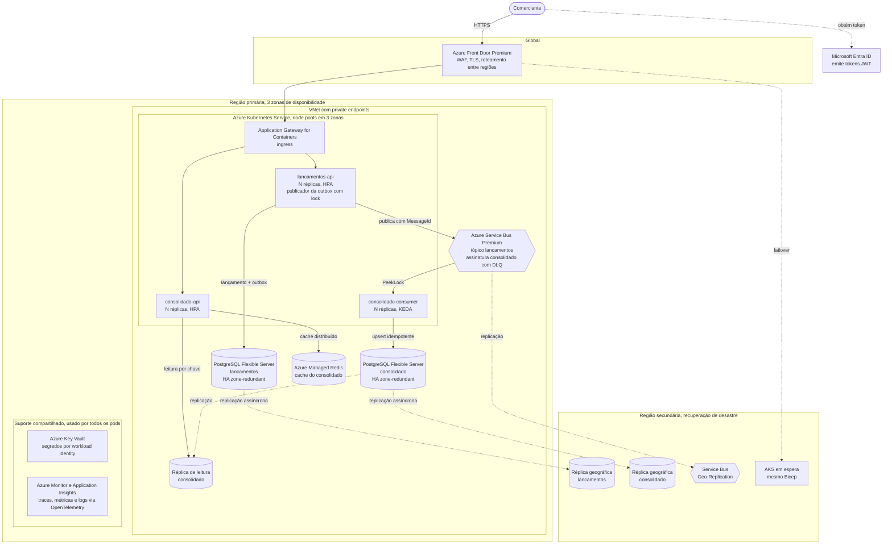

# Arquitetura alvo na Azure

Este documento descreve como a solução rodaria em produção na Azure. A versão local usa docker compose, nginx, RabbitMQ e PostgreSQL em containers. Aqui cada peça é trocada por um serviço gerenciado, com alta disponibilidade dentro da região e recuperação de desastre em uma segunda região.

As garantias principais **não dependem da plataforma**. A outbox, o consumidor idempotente, o saldo pré-calculado e a independência entre os serviços continuam iguais. O que muda são as peças de infraestrutura e algumas bibliotecas.

## Diagrama

## Equivalência entre o ambiente local e a Azure

| Peça local | Serviço na Azure | Por quê |
|---|---|---|
| nginx como balanceador | **Azure Front Door Premium** na borda, com WAF, e **Application Gateway for Containers** como ingress do AKS | O Front Door termina TLS, filtra ataques e faz o failover entre regiões. O ingress distribui entre os pods |
| Réplicas no docker compose | **Azure Kubernetes Service (AKS)** com node pools em 3 zonas | Escala horizontal automática e tolerância à queda de uma zona. O **Azure Container Apps** é uma alternativa mais simples, com KEDA embutido |
| RabbitMQ | **Azure Service Bus Premium**: tópico `lancamentos`, assinatura `consolidado` | Gerenciado, com zonas de disponibilidade, DLQ nativa, contagem de entregas e detecção de duplicatas |
| PostgreSQL em container (um por serviço) | **Azure Database for PostgreSQL Flexible Server**, um servidor por serviço | Mantém o isolamento de falha entre os serviços, como no [ADR 0001](adr/0001-dois-servicos.md) |
| Cache em memória por réplica | **Azure Managed Redis** | Cache e último valor conhecido compartilhados entre as réplicas, sobrevivendo a restarts. O Azure Cache for Redis está em processo de aposentadoria, por isso a escolha é o Azure Managed Redis |
| Variáveis de ambiente com padrão `local-dev` | **Azure Key Vault** com **workload identity** | Nenhum segredo em variável de ambiente nem no repositório. O acesso ao PostgreSQL pode usar autenticação do Entra ID, sem senha |
| API Key no header `X-Api-Key` | **Microsoft Entra ID** com JWT e escopos (`lancamentos.escrita`, `consolidado.leitura`) | Identidade por usuário ou aplicação, com expiração e revogação. O **Azure API Management** pode ficar na frente, se a empresa já o usar para governança de APIs |
| Logs no console | **Azure Monitor** com **Application Insights**, via OpenTelemetry | Traces de ponta a ponta, métricas e alertas |
| docker-compose.yml | **Bicep**, aplicado por pipeline | Toda a infraestrutura versionada e reproduzível, inclusive a região secundária |

## Escalabilidade

| Componente | Como escala | Gatilho |
|---|---|---|
| `lancamentos-api` | Horizontal, por réplicas no AKS | **HPA** por CPU ou por requisições por segundo |
| Publicador da outbox | Roda em todas as réplicas da API, mas só uma publica por vez, graças ao advisory lock do PostgreSQL ([ADR 0008](adr/0008-escalabilidade-horizontal.md)) | Não precisa escalar. Uma instância publica centenas de eventos por segundo. Se precisar de mais, a outbox pode ser particionada por chave, com um lock por partição |
| `consolidado-api` | Horizontal, por réplicas no AKS | **HPA** por CPU ou por requisições por segundo |
| `consolidado-consumer` | Horizontal, como deployment separado da API de leitura | **KEDA** com o scaler do Service Bus, pelo número de mensagens na assinatura. Com a fila vazia ele pode cair para o mínimo |
| Leitura do saldo | Redis compartilhado na frente e **réplica de leitura** do PostgreSQL atrás | A leitura já é eventualmente consistente, então o pequeno atraso da réplica é aceitável |
| Escrita de lançamentos | Vertical no PostgreSQL. Se um dia não bastar, particionamento da tabela por data | Monitoramento de CPU e IOPS do servidor |
| Service Bus | Messaging units do tier Premium | Uso de CPU e memória do namespace |

O advisory lock usado pelo publicador é preso a uma transação (`pg_try_advisory_xact_lock`). Por isso ele funciona também com o PgBouncer embutido do Flexible Server em modo de transação.

## Alta disponibilidade dentro da região

| Componente | Mecanismo | Efeito de uma queda de zona |
|---|---|---|
| Front Door | Serviço global | Não é afetado |
| AKS | Node pools distribuídos em 3 zonas, pelo menos 2 réplicas por deployment, PodDisruptionBudget | As réplicas das outras zonas continuam atendendo |
| PostgreSQL Flexible Server | **HA zone-redundant**: um standby em outra zona, com replicação síncrona | Failover automático em cerca de 60 a 120 s, sem perda de dados confirmados (RPO zero) |
| Service Bus Premium | Zonas de disponibilidade | Transparente para os clientes |
| Azure Managed Redis | Alta disponibilidade com réplicas em zonas | Transparente. E, se o cache cair, a API continua lendo do banco |

Durante o failover do banco de lançamentos, os POSTs falham por até cerca de 2 minutos. O `EnableRetryOnFailure` do EF Core absorve parte desse tempo. A `Idempotency-Key` permite que o cliente repita o POST com segurança. O consolidado continua respondendo pelo Redis e pela réplica de leitura.

## Recuperação de desastre entre regiões

Estratégia **ativo-passivo**: uma região atende e a outra fica pronta para assumir.

| Componente | Mecanismo | Perda de dados (RPO) |
|---|---|---|
| PostgreSQL de lançamentos e do consolidado | **Réplica de leitura em outra região** com **virtual endpoints**. No desastre, a réplica é promovida a primária e o endpoint passa a apontar para ela, sem mudar a connection string | Segundos. A replicação entre regiões é assíncrona |
| Service Bus | **Geo-Replication** do tier Premium, que replica metadados e mensagens. A região secundária é promovida e o mesmo hostname passa a apontar para ela | Configurável entre replicação síncrona e assíncrona |
| AKS e demais recursos | Mesmo Bicep aplicado na região secundária. Pode ficar mínimo (warm standby) ou ser criado só no desastre | Não guarda dados |
| Front Door | Health probes nas duas regiões e failover automático do roteamento | Não guarda dados |

> **Sobre "failover group":** esse recurso é do **Azure SQL Database** (auto-failover groups). No PostgreSQL Flexible Server, o equivalente é a réplica geográfica com virtual endpoints, descrita acima. Se a empresa preferir Azure SQL, os auto-failover groups fazem esse papel, mas a troca de banco exigiria adaptar o SQL do `ON CONFLICT` para `MERGE`.

**Por que a solução se recupera bem de um desastre:** depois do failover pode haver pequenas diferenças. Algum evento pode ter sido publicado mas não marcado na outbox, ou entregue duas vezes. A idempotência do consumidor absorve isso e o saldo volta a convergir sozinho, como o teste de caos mostra localmente.

Metas sugeridas, para validar com o negócio:

| Meta | Valor sugerido |
|---|---|
| RTO, tempo para voltar a operar em outra região | Até 1 hora |
| RPO, perda máxima de lançamentos confirmados num desastre regional | Até 5 minutos |
| RPO numa queda de zona | Zero |

## Segurança

- **Borda:** Front Door com WAF e TLS 1.2 ou superior.
- **Identidade:** tokens JWT do Entra ID, validados pelas APIs.
- **Rede:** comunicação interna por **private endpoints**. Banco, Service Bus, Redis e Key Vault ficam sem acesso público.
- **Segredos:** os pods usam **workload identity** para acessar o Key Vault, o Service Bus e o PostgreSQL. Não existe senha guardada.
- **Proteção:** Microsoft Defender for Cloud e criptografia em repouso, que já vem habilitada nos serviços gerenciados.

## Observabilidade

OpenTelemetry nas duas APIs, exportando para o Application Insights. As métricas que importam para os SLOs ([requisitos não funcionais](requisitos-nao-funcionais.md)):

| Métrica | Para que serve | Alerta |
|---|---|---|
| Idade do evento mais antigo pendente na outbox | Atraso de publicação | Acima de 1 minuto |
| Mensagens ativas e idade da mais antiga na assinatura | Atraso de consumo. Detecta um consumidor travado | Acima de 1 minuto |
| Mensagens na DLQ | Eventos que não puderam ser aplicados | Qualquer mensagem |
| Taxa de respostas com `X-Stale-Data` | Consolidado servindo valores de fallback | Acima de 1% |
| Taxa de erro e p95 por endpoint | Comparação direta com os SLOs | Perda acima de 1% ou p95 acima de 200 ms |

Um trace distribuído liga o `POST /lancamentos` à publicação e à atualização do saldo, usando o `MessageId` e o contexto de trace nas propriedades da mensagem.

## O que muda no código

| Parte | Hoje | Na Azure |
|---|---|---|
| Publicação | `RabbitMQ.Client` com publisher confirms e `mandatory` | `Azure.Messaging.ServiceBus`. O `MessageId` recebe o Id do evento e a **detecção de duplicatas** do Service Bus descarta reenvios dentro da janela configurada. A outbox continua igual |
| Consumo | Ack manual, `reject` com requeue e quorum queue com limite de entregas | `ServiceBusProcessor` em modo PeekLock: `Complete` depois do commit, `Abandon` para erro inesperado (o `MaxDeliveryCount` manda para a DLQ) e `DeadLetter` para mensagem inválida. A idempotência continua igual |
| Cache | `IMemoryCache` | `HybridCache` com Redis como segundo nível |
| Autenticação | Middleware de API Key | `AddJwtBearer` com o Entra ID e políticas por escopo |
| Configuração | Variáveis de ambiente | Key Vault e workload identity |

O domínio, a outbox, o upsert idempotente, os endpoints e os testes de domínio não mudam.

## Infraestrutura como código

Módulos Bicep sugeridos, aplicados pelo pipeline em cada região:

- `rede.bicep`: VNet, subnets e zonas DNS privadas
- `aks.bicep`: cluster, node pools em zonas e workload identity
- `postgres.bicep`: os dois Flexible Servers, HA zone-redundant, réplicas de leitura e geográficas e virtual endpoints
- `servicebus.bicep`: namespace Premium, tópico, assinatura com `MaxDeliveryCount` 5 e geo-replicação
- `redis.bicep`, `keyvault.bicep`, `frontdoor.bicep` e `monitor.bicep`

Os manifestos do Kubernetes (deployments, HPA, KEDA ScaledObject, PodDisruptionBudget) ficariam num chart Helm por serviço.
