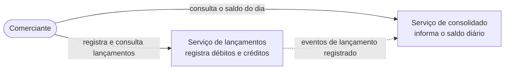
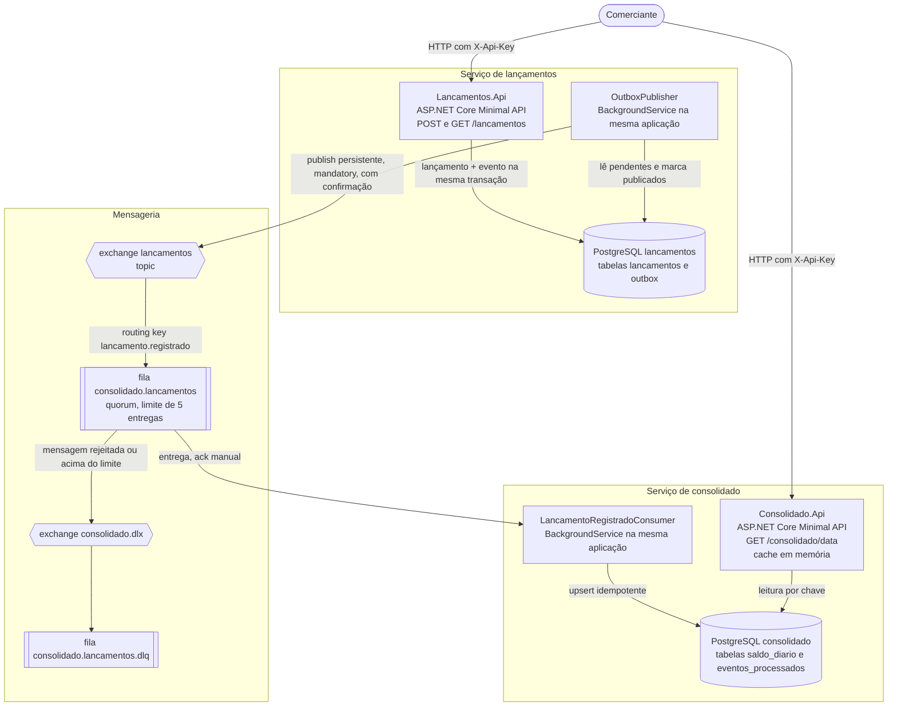
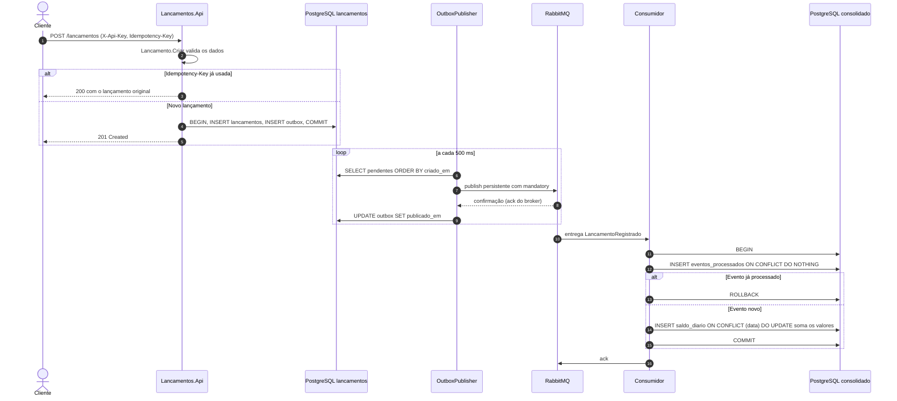
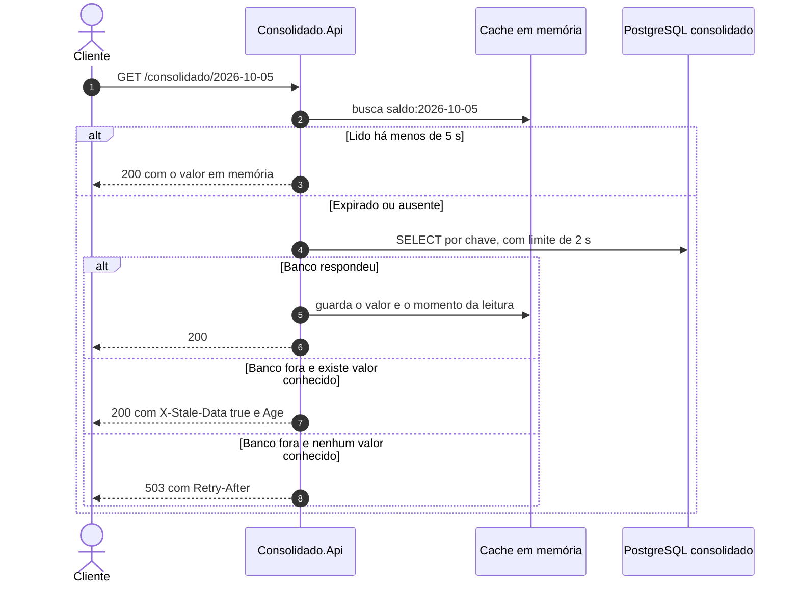

# Arquitetura

Este documento descreve como a solução está organizada e como um lançamento chega até o saldo consolidado. As decisões e os motivos de cada uma estão nos [ADRs](adr).

## Contexto

O comerciante usa dois serviços. Um registra os lançamentos do dia. O outro informa o saldo consolidado de cada dia.

A seta pontilhada é a única ligação entre os serviços: eventos assíncronos. Nenhum serviço chama o outro por HTTP. Por isso a queda do consolidado não afeta o registro de lançamentos.

## Containers

| Container | Responsabilidade | Depende de |
|---|---|---|
| Lancamentos.Api | Valida e grava lançamentos. Grava o evento na outbox | Somente o PostgreSQL de lançamentos |
| OutboxPublisher | Publica os eventos pendentes no RabbitMQ, em ordem | PostgreSQL de lançamentos e RabbitMQ. Se o RabbitMQ estiver fora, espera e tenta de novo |
| RabbitMQ | Guarda e entrega os eventos | Nada |
| LancamentoRegistradoConsumer | Aplica cada evento ao saldo do dia, uma única vez | RabbitMQ e PostgreSQL do consolidado |
| Consolidado.Api | Responde o saldo de um dia | PostgreSQL do consolidado. Se ele cair, usa o último valor conhecido em memória |

O publicador e o consumidor rodam como `BackgroundService` dentro das APIs. Isso simplifica a entrega e a execução local. Em produção cada um pode virar um processo separado sem mudar o código das classes (ver [ADR 0007](adr/0007-simplificacoes-assumidas.md)).

## Sequência do registro de um lançamento

Pontos importantes da sequência:

- **Passos 4 e 5.** A resposta `201` só sai depois do commit que contém o lançamento e o evento. Essa é a invariante central.
- **Passos 7 a 9.** Se a aplicação cair entre o publish e o `UPDATE`, o evento é publicado de novo no próximo ciclo. Isso gera uma entrega duplicada, que o consumidor ignora.
- **Passos 11 a 16.** O ack ao RabbitMQ só acontece depois do commit. Se o consumidor cair antes do ack, a mensagem volta para a fila e a tabela `eventos_processados` impede a soma dupla.

## Sequência da consulta do saldo

A leitura nunca soma lançamentos. Ela busca uma única linha pela chave primária `data`. Um dia sem lançamentos devolve saldo zero.

## Topologia do RabbitMQ

| Objeto | Tipo | Declarado por | Detalhes |
|---|---|---|---|
| `lancamentos` | exchange topic, durável | Publicador e consumidor | Recebe os eventos `LancamentoRegistrado` |
| `consolidado.lancamentos` | fila quorum, durável | Consumidor | Ligada ao exchange pela routing key `lancamento.registrado`. `x-delivery-limit` de 5 e dead letter para `consolidado.dlx` |
| `consolidado.dlx` | exchange fanout, durável | Consumidor | Recebe as mensagens descartadas da fila principal |
| `consolidado.lancamentos.dlq` | fila clássica, durável | Consumidor | Guarda as mensagens para análise e reprocessamento manual |

O consumidor trata os erros de três formas diferentes:

| Situação | Tratamento | Motivo |
|---|---|---|
| Mensagem inválida (JSON quebrado, tipo desconhecido, valor não positivo) | `basic.reject` sem requeue. Vai direto para a DLQ | Nunca vai ser processada com sucesso |
| Banco do consolidado fora | A mensagem fica com o consumidor, sem ack, e o processamento é repetido a cada 5 s | O problema não é da mensagem. Ela não deve gastar tentativas nem ir para a DLQ |
| Erro inesperado (por exemplo, um bug ou uma tabela ausente) | `basic.reject` com requeue. Depois de 5 entregas, o RabbitMQ move para a DLQ | Dá chance de recuperação sem travar a fila para sempre |

> Desde o RabbitMQ 4.3, a quorum queue só conta para o `x-delivery-limit` as devoluções feitas com `basic.reject`. Uma devolução com `basic.nack` não conta. Por isso o consumidor usa `reject` com requeue. Um teste de integração encontrou esse comportamento: com `nack`, uma mensagem com erro voltou para a fila 3.616 vezes em 30 segundos.

## Modelo de dados

**Banco de lançamentos**

| Tabela | Colunas | Observações |
|---|---|---|
| `lancamentos` | `id`, `data`, `tipo`, `valor` numeric(18,2), `descricao`, `criado_em`, `idempotency_key` | Índice por `data`. Índice único em `idempotency_key` |
| `outbox` | `id`, `tipo`, `payload` jsonb, `criado_em`, `publicado_em` | Índice parcial em `criado_em` onde `publicado_em IS NULL`. Eventos publicados há mais de 7 dias são apagados a cada hora |

**Banco do consolidado**

| Tabela | Colunas | Observações |
|---|---|---|
| `saldo_diario` | `data` (chave primária), `total_creditos` numeric(20,2), `total_debitos` numeric(20,2), `atualizado_em` | O saldo é calculado como créditos menos débitos |
| `eventos_processados` | `evento_id` (chave primária), `processado_em` | Garante que cada evento é aplicado uma vez |

Os Ids usam UUID versão 7, que é ordenado pelo tempo e evita fragmentação dos índices.

## Evolução futura

### Na nuvem (Azure)

| Tema | Hoje | Evolução |
|---|---|---|
| Hospedagem | docker compose | Azure Kubernetes Service (AKS). Cada serviço com seu deployment, réplicas e Horizontal Pod Autoscaler. O consumidor vira um deployment separado da API de leitura, para escalar cada um pela sua própria carga |
| Mensageria | RabbitMQ em container | Azure Service Bus com tópico e assinatura. Dead-lettering, contagem de entregas e reentrega já vêm prontos. Sessões permitem ordenação por chave se necessário |
| Banco de dados | PostgreSQL em container | Azure Database for PostgreSQL Flexible Server com alta disponibilidade zone-redundant e backups automáticos. Um servidor por serviço, para manter o isolamento de falhas |
| Segredos | Variáveis de ambiente com padrão local | Azure Key Vault, lido pela aplicação com managed identity. Nenhuma senha em variável de ambiente |
| Cache | Memória de cada instância | Azure Cache for Redis. Todas as réplicas compartilham o mesmo cache e o último valor conhecido sobrevive a um restart |
| Autenticação | API Key compartilhada | JWT emitido pelo Microsoft Entra ID, com escopos separados como `lancamentos.escrita` e `consolidado.leitura` |
| Observabilidade | Logs no console | OpenTelemetry com Azure Monitor. Trace do POST até a atualização do saldo, métricas da idade do evento mais antigo da outbox e do tamanho da fila, alerta para qualquer mensagem na DLQ |
| Infraestrutura | docker-compose.yml | Bicep para todos os recursos, aplicado pelo pipeline de CI/CD |

### No negócio

- **Estorno.** Um novo tipo de lançamento que referencia o original e anula o seu efeito no saldo. O histórico continua imutável.
- **Vários comerciantes.** O Id do comerciante entra no lançamento, no evento e na chave de `saldo_diario`, que passa a ser `(comerciante_id, data)`. O comerciante viria do token JWT.

### Melhorias técnicas

- **Vários publicadores da outbox.** Com mais de uma réplica da Lancamentos.Api, dois publicadores podem publicar o mesmo evento. O consumidor idempotente já absorve isso. Para evitar o trabalho repetido, a leitura passaria a usar `SELECT ... FOR UPDATE SKIP LOCKED`.
- **Migrations no pipeline.** Hoje cada API aplica as migrations ao subir. Em produção isso vira uma etapa do deploy, antes da troca de versão.
- **Reprocessamento da DLQ.** Uma rotina para devolver mensagens da DLQ para a fila principal depois que a causa for corrigida. Como o consumidor é idempotente, reprocessar é seguro.
- **Paginação.** O `GET /lancamentos` devolve todos os lançamentos do dia. Com volume alto, ele precisaria de paginação.
- **Rate limiting.** Limite de requisições por cliente nas duas APIs.
